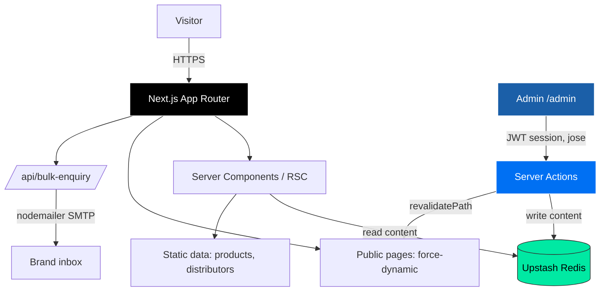

<div align="center">

# 🧼 Wasro

### Modern Indian FMCG Brand Website — Detergent · Dishwash · Clothwash

[](https://nextjs.org/)
[](https://www.typescriptlang.org/)
[](https://reactjs.org/)
[](https://tailwindcss.com/)
[](https://upstash.com/)
[](https://vercel.com/)

[🚀 Features](#-features) • [📦 Quick Start](#-quick-start) • [🛠️ Tech Stack](#️-tech-stack) • [🔐 Admin Panel](#-admin-panel) • [🧪 Testing](#-testing) • [📁 Structure](#-project-structure)

</div>

---

## 🎯 Overview

**Wasro** is the official brand website for **Wasro**, a value-tier home-care FMCG range — detergent powders, dishwash bars, dishwash tubs, and clothwash bars — manufactured in Assam by **Madhav Industries** and stocked at **121+ retail stores** across Northeast India and beyond.

The site is a fully server-rendered **Next.js 16 (App Router)** application with a built-in, no-code **admin CMS** backed by **Upstash Redis** — so the brand owner can update offers, prices, featured products, hero copy, FAQs, and customer reviews live, with zero developer involvement and no redeploy.

### Why this build?

| Capability | Description |
|---|---|
| 🛍️ **Full product catalogue** | 14 SKUs across 4 categories with per-pack pricing, free-gift badges, and "find in store" routing |
| 🔐 **No-code admin CMS** | 8 editable sections (offers, pricing, hero, featured, headlines, why-us, FAQs, reviews) — saves go live instantly via Redis + `revalidatePath` |
| 📍 **Store locator** | 121+ distributors filterable by state, each with one-tap call + WhatsApp |
| 🧴 **Stain guide** | Indian-household stain-removal guide with `HowTo` structured data per entry |
| 📦 **Bulk-order pipeline** | Validated enquiry form → Nodemailer → brand inbox, for shops, hostels, hotels & NGOs |
| ⭐ **Reviews + ratings** | Admin-managed testimonials rendered as a draggable swipe-card deck, feeding `AggregateRating` schema |
| 🎬 **Branded splash + motion** | First-visit splash, scroll reveals, magnetic buttons, and a smooth-scroll engine (Lenis) |
| 🔍 **SEO-complete** | JSON-LD (Organization, LocalBusiness, Product, FAQ, Breadcrumb, AggregateRating), dynamic sitemap with image entries, robots, OG images |
| 🛡️ **Hardened** | DPDP-compliant cookie consent + full security-header set (CSP, X-Frame-Options, HSTS, etc.) |

**Positioning:** Modern Indian FMCG — approachable, value-first, trustworthy — *not* premium D2C.

---

## 📦 Quick Start

```bash
# Clone
git clone https://github.com/Ajinkyaa2004/Wasro-Detergent-Brand.git
cd Wasro-Detergent-Brand

# Install
npm install

# Configure environment (see Installation below)
cp .env.local.example .env.local
# …then fill in your Upstash, admin, and SMTP values

# Run
npm run dev
```

Open [http://localhost:3000](http://localhost:3000) 🎉

> The site runs **without** any env vars too — it falls back to in-memory storage and sensible defaults. Upstash + SMTP are only needed for persistent admin edits and live bulk-order emails.

---

## 🎬 Demo

**🌐 Live:** [wasro.vercel.app](https://wasro.vercel.app)

<details>
<summary>📸 Key surfaces (click to expand)</summary>

```
Public:
  /                 Home — hero offer slideshow, pack sizes, featured products,
                    why-Wasro, stain teaser, bulk CTA, reviews swipe deck, press
  /products         All 14 SKUs across 4 themed category sections
  /find-store       121+ distributors, filter by state, call / WhatsApp
  /stain-guide      Stain-by-stain removal guide (HowTo schema)
  /about            Brand story + Madhav Industries plant + FAQs
  /bulk-orders      Wholesale enquiry form (Nodemailer)
  /privacy /terms /shipping /returns   Legal pages
  *                 Branded 404

Admin (auth-gated):
  /admin            Dashboard
  /admin/offer      Hero offer slideshow
  /admin/hero-content, /headlines, /featured, /pricing,
  /admin/why-us, /faqs, /reviews
```

</details>

---

## ✨ Features

<table>
<tr>
<td width="50%">

### 🛍️ Product Experience

- 14 SKUs across detergent powder, dishwash bar, dishwash tub & clothwash bar
- Themed category sections with wave dividers
- Per-pack MRP, free-gift badges, "find in store" CTAs
- "Three pack sizes" + "Family favourites" home modules
- WebP-optimised pack imagery (98% smaller than source)

</td>
<td width="50%">

### 🔐 No-Code Admin CMS

- 8 editable content areas, password-gated (JWT session via `jose`)
- Live preview panels in each editor
- Saves persist to Upstash Redis + `revalidatePath` → instant on the public site
- Storage-health banner warns if Redis isn't wired
- Per-SKU price overrides without touching code

</td>
</tr>
<tr>
<td width="50%">

### 📍 Store Locator & Bulk Orders

- 121+ distributors, filter by state, browse by city
- One-tap call + pre-filled WhatsApp per store
- "Become a distributor" enquiry path
- Validated bulk-order form → Nodemailer → brand inbox
- Page-aware WhatsApp deep-links across the site

</td>
<td width="50%">

### ⭐ Trust & Conversion

- Admin-managed reviews → draggable swipe-card deck
- `AggregateRating` star-snippet eligibility
- Press / recognition strip
- Newsletter capture (Upstash-backed, honeypot-protected)
- Stain guide that routes to the right product

</td>
</tr>
<tr>
<td width="50%">

### 🎨 Motion & Polish

- First-visit branded splash (session-gated, reduced-motion aware)
- Lenis smooth-scroll + scroll-triggered reveals
- Magnetic buttons, tilt cards, bubble fields
- Framer-motion layered transitions
- Fully responsive, mobile-first

</td>
<td width="50%">

### 🔍 SEO & Compliance

- JSON-LD: Organization, LocalBusiness, Product, FAQ, Breadcrumb, AggregateRating
- Dynamic `sitemap.xml` (incl. per-SKU image entries) + `robots.txt`
- Dynamic OG image + per-page metadata
- DPDP-Act cookie consent banner
- Full security-header set (CSP, X-Frame-Options, HSTS, Referrer-Policy…)

</td>
</tr>
</table>

---

## 🛠️ Tech Stack


<details>
<summary><b>📋 Complete technology breakdown</b></summary>

### Core

| Technology | Version | Purpose |
|---|---|---|
| **Next.js** | 16.2.6 | App Router, RSC, server actions, dynamic rendering |
| **React** | 19.2 | UI library |
| **TypeScript** | 5 | Type-safe development |
| **Tailwind CSS** | 4 | Utility-first styling (`@theme` tokens, PostCSS) |

### Data & Backend

| Package | Purpose |
|---|---|
| **@upstash/redis** | Serverless Redis — persists all admin-editable content |
| **jose** | Signed JWT admin sessions |
| **nodemailer** | Bulk-order enquiry emails (SMTP) |
| **server-only** | Guards server modules from client bundles |

### UI & Motion

| Package | Purpose |
|---|---|
| **framer-motion** | Splash, reveals, swipe-card deck, transitions |
| **lenis** | Smooth-scroll engine |
| **lucide-react** | Icon set |
| **clsx** + **tailwind-merge** | Conditional / conflict-free class composition |

### Tooling

| Tool | Purpose |
|---|---|
| **ESLint** (`eslint-config-next`) | Linting |
| **Selenium + pytest** | End-to-end UI test suite (`/tests`) |
| **Vercel** | Hosting & CI deploys |

</details>

---

## 🏗️ Architecture



### Design patterns

| Pattern | Implementation | Benefit |
|---|---|---|
| **Content resolver** | `Upstash override → data-file default → null` | Admin edits win; safe fallbacks always exist |
| **Force-dynamic public pages** | `export const dynamic = "force-dynamic"` | Admin saves appear instantly, no redeploy |
| **`revalidatePath` on write** | Every admin action revalidates its public page(s) | Cache never serves stale content |
| **Server-only data layer** | `server-only` + `lib/server/*` | Secrets & Redis never reach the client bundle |
| **Filesystem image auto-detect** | `lib/server/product-images.ts` scans `/public/products` | Drop an image in, it resolves automatically |
| **Graceful storage fallback** | In-memory Map when Redis env vars are absent | Runs locally / in demos with zero config |

---

## 💻 Installation

### Prerequisites

- 📦 **Node.js** 18.18+ (20+ recommended)
- 🟢 **Upstash Redis** database — [console.upstash.com](https://console.upstash.com/) *(optional; falls back to in-memory)*
- 📧 **SMTP credentials** for bulk-order emails *(optional)*

### 1️⃣ Clone & install

```bash
git clone https://github.com/Ajinkyaa2004/Wasro-Detergent-Brand.git
cd Wasro-Detergent-Brand
npm install
```

### 2️⃣ Configure environment

```bash
cp .env.local.example .env.local
```

Then fill in `.env.local`:

```bash
# Persistent admin storage (optional — falls back to in-memory)
UPSTASH_REDIS_REST_URL=https://your-db.upstash.io
UPSTASH_REDIS_REST_TOKEN=your_token

# Admin panel
ADMIN_PASSWORD=choose_a_strong_password
ADMIN_SECRET=32+_char_random_string_for_jwt_signing

# Bulk-order emails (optional)
SMTP_HOST=smtp.gmail.com
SMTP_PORT=465
SMTP_SECURE=true
SMTP_USER=you@example.com
SMTP_PASS=your_app_password
MAIL_TO=orders@example.com
MAIL_FROM=you@example.com
```

> ⚠️ **Never commit `.env.local`.** It's gitignored — along with `/_secrets/` and `/_docs/`.

### 3️⃣ Run

```bash
npm run dev      # development (Turbopack)
npm run build    # production build
npm run start    # serve production build
npm run lint     # ESLint
```

---

## 🔐 Admin Panel

The admin CMS lives at **`/admin`** and is gated by a password + signed JWT session.

| Section | Route | What it controls |
|---|---|---|
| **Dashboard** | `/admin` | Overview + storage-health banner |
| **Hero offer** | `/admin/offer` | Up to 3 rotating hero slides (each swaps its own product image) |
| **Hero content** | `/admin/hero-content` | Brand chip, headline, subtitle, CTAs, stats |
| **Featured** | `/admin/featured` | "Family favourites" product grid |
| **Pricing** | `/admin/pricing` | Per-SKU MRP overrides (home, products, stain-guide, SEO) |
| **Headlines** | `/admin/headlines` | Rotating words in the hero headline |
| **Why Wasro** | `/admin/why-us` | The four value-prop cards |
| **FAQs** | `/admin/faqs` | About-page accordion + FAQ rich-result schema |
| **Reviews** | `/admin/reviews` | Testimonials + star aggregate |

Every save writes to Upstash and calls `revalidatePath`, so changes are live on the public site **immediately** — no redeploy.

---

## 📁 Project Structure

```
Wasro-Detergent-Brand/
├── app/                          # Next.js App Router
│   ├── page.tsx                  # Home
│   ├── layout.tsx                # Root layout, metadata, favicons
│   ├── products/                 # Catalogue (force-dynamic)
│   ├── find-store/               # Distributor locator
│   ├── stain-guide/              # Stain removal guide (HowTo schema)
│   ├── about/                    # Brand story + plant + FAQs
│   ├── bulk-orders/              # Wholesale enquiry form
│   ├── privacy / terms /         # Legal pages
│   │   shipping / returns/
│   ├── admin/                    # Password-gated CMS (8 editors)
│   ├── api/bulk-enquiry/         # Nodemailer endpoint
│   ├── sitemap.ts / robots.ts    # Dynamic SEO routes
│   ├── manifest.ts               # PWA manifest
│   ├── opengraph-image.tsx       # Dynamic OG image
│   ├── icon.png / apple-icon.png # Favicons (Wasro mark)
│   └── not-found.tsx             # Branded 404
├── components/
│   ├── sections/                 # Home/page sections (hero, reviews, etc.)
│   ├── products/                 # Category + product-card components
│   ├── layout/                   # Navbar, footer, splash, cookie, WhatsApp
│   ├── find-store/               # Distributor finder + cards
│   └── ui/                       # Reveal, tilt, magnetic button, bubbles…
├── lib/
│   ├── server/                   # Server-only resolvers (products, images)
│   ├── storage.ts                # Upstash ⇄ in-memory KV abstraction
│   ├── offer / faqs / reviews /  # Admin-editable content modules
│   │   headlines / why-wasro …
│   ├── seo.tsx                   # JSON-LD builders + metadata helpers
│   └── utils.ts                  # SITE config + cn()
├── data/
│   ├── products.ts               # 14 SKUs (source of truth)
│   └── distributors*             # 121+ store records
├── public/
│   ├── products/                 # WebP pack shots (auto-detected)
│   └── lifestyle/                # Scene & manufacturing imagery
├── tests/                        # Selenium + pytest E2E suite
├── proxy.ts                      # Edge middleware
├── next.config.ts                # Security headers
└── README.md
```

---

## 🧪 Testing

End-to-end UI coverage with **Selenium + pytest** (~118 tests) in [`/tests`](tests).

```bash
cd tests
python3 -m venv .venv
.venv/bin/pip install -r requirements.txt

# In another terminal: npm run dev
./run.sh                                   # full read-only suite (headless)
./run.sh -m smoke                          # critical-path smoke tests
WASRO_HEADED=1 ./run.sh                     # watch the browser
WASRO_BASE_URL=https://wasro.vercel.app ./run.sh   # against production
```

**Coverage:** homepage sections, navbar + footer links, cookie banner, reviews swipe deck, products grid, find-store / stain-guide / about, bulk-order validation, policy pages + 404, full admin login + every editor, splash screen, and admin write→public-read propagation.

> Write-safety: the read-only suite never submits forms or mutates data. The `write`-marked tests (admin save → public read) require `WASRO_ADMIN_PASSWORD` and restore original values.

---

## 🚀 Deployment

Deployed on **Vercel**.

1. Push to GitHub
2. Import the repo at [vercel.com](https://vercel.com)
3. Framework preset: **Next.js** (auto-detected)
4. Add environment variables (Upstash, admin, SMTP — see [Installation](#-installation))
5. Deploy

> Public content pages are `force-dynamic`, so admin edits via Upstash reflect on the live site instantly without a redeploy.

---

## 🗺️ Roadmap

### ✅ Shipped
- [x] Full catalogue, store locator, stain guide, bulk-order pipeline
- [x] No-code admin CMS (8 sections) on Upstash
- [x] Reviews swipe deck + AggregateRating schema
- [x] Branded splash, cookie consent (DPDP), security headers
- [x] WebP image pipeline, full JSON-LD + sitemap, Selenium suite

### 🚧 Planned
- [ ] Real Instagram / Facebook handles wired into `SITE.sameAs`
- [ ] Quick-commerce buy buttons (Swiggy / Blinkit / BigBasket / JioMart)
- [ ] Bulk-enquiry inbox view inside admin
- [ ] Multi-language (Hindi / Assamese)
- [ ] Blog / content hub for organic SEO

---

<div align="center">

## 🧼 Wasro

Built for **Madhav Industries** · Made in Assam · Trusted Clean for Every Home

</div>
